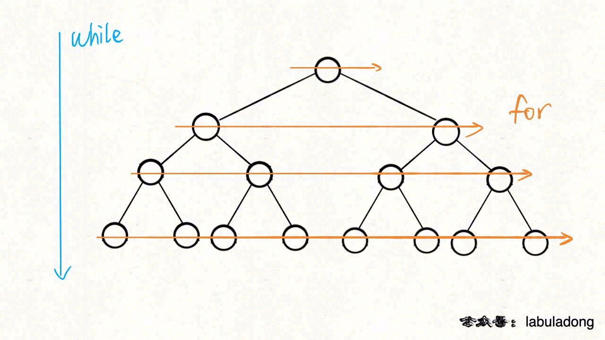

# 二叉树解题的思维模式分两类

https://labuladong.github.io/algo/1/4/

-   是否可以通过遍历一遍二叉树得到答案
-   递归函数 通过子树推导出答案

快速排序就是个二叉树的前序遍历，归并排序就是个二叉树的后序遍历

快排

```py
def sort(nums, lo, hi):
    # ------- 前序遍历位置
    p = partition(nums,ol,hi)
    # ------- end 前序遍历位置

    sort(nums, lo, p-1)
    sort(nums, p+1, hi)
```

归并

```py
def sort(nums, ol, hi):
    mid = (ol, hi) //2

    # sort nums[lo..mid]
    sort(nums, lo, mid)

    # sort nums[mid+1..hi]
    sort(nums, mid+1, hi)


    # ------------ 后序位置 ---
    # 合并 nums[lo..mid] 和 nums[mid+1..hi]
    marge(nums, lo, mid, hi)
    # ------------ 后序位置 ---
```

```py
def traverse(root):
    if not root:
        return
    # 前序位置
    travase(root.left)
    # 中序位置
    travase(root.right)
    # 后序位置

```

```py
'''
遍历数组
'''
def traverse(arr: int[]):
    for i in arr:
        pass
def traverse(arr: int[],i):
    if i == len(arr):
        return
    # 前序
    traverse(arr, i+1)
    # 后序

'''
遍历单链表
'''
def traverse(head: ListNode):
    p = head
    while p:
        p = p.next

def traverse(head: ListNode):
    if not head:
        return
    # 前序
    traverse(head.next)
    # 后序

```

你也注意到了，只要是递归形式的遍历，都可以有前序位置和后序位置，分别在递归之前和递归之后。


-   所谓前序位置，就是刚进入一个节点（元素）的时候，
-   后序位置就是即将离开一个节点（元素）的时候

倒序打印一条单链表上所有节点的值

```py
def traverse(head):
    if not head:
        return
    traverse(head.next)

    # 后序位置
    print(head.val)
```

-   前序位置的代码在刚刚进入一个二叉树节点的时候执行；
-   后序位置的代码在将要离开一个二叉树节点的时候执行；
-   中序位置的代码在一个二叉树节点左子树都遍历完，即将开始遍历右子树的时候执行


# leet code 104 最大深度

```py
res = 0
depth = 0

def maxDpth(root):
    traverse(root)
    return res

def traverse(root):
    if not root:
        return
    # 前序位置
    depth+=1

    # 到达叶子节点, 更新最大深度
    if not root.left and not root.right:
        res = max(res, depth)
    traverse(root.left)
    traverse(root.right)
    # 后序位置
    depth -=1
```

```py
def maxDepth(root):
    if not root:
        return 0
    left_max = maxDepth(root.left)
    right_max = maxDepth(root.right)

    return max(left_max,right_max) +1
```

中序位置主要用在 BST 场景中，你完全可以把 BST 的中序遍历认为是遍历有序数组。
前序位置的代码只能从函数参数中获取父节点传递来的数据，而后序位置的代码不仅可以获取参数数据，还可以获取到子树通过函数返回值传递回来的数据。

如果把根节点看做第 1 层，如何打印出每一个节点所在的层数？

```py

def traverse(root, level =1):
    if not root:
        return 0
    print(level)
    traverse(root.left, level+1)
    traverse(root.right,level+1)
traverse(root, 1)
```

如何打印出每个节点的左右子树各有多少节点

```py
def traverse(root):
    if not root:
        return 0
    l_c = traverse(root.left)
    r_c = traverse(root.right)

    return l_c + r_c  + 1
traverse(root)
```

543 题「 二叉树的直径」

### 层序遍历

二叉树题型主要是用来培养递归思维的，而层序遍历属于迭代遍历



```py

# // 输入一棵二叉树的根节点，层序遍历这棵二叉树
def levelTraverse(root):
    if not root:
        return
    q = []
    q.append(root)

    # 从上到下遍历二叉树的每一层
    while q:
        sz = len(q)
        i = 0
        for i in q:
            cur = q.pop(0)
            # 将下一层节点放入队列
            if cur.left:
                q.append(cur.left)

            if cur.right:
                q.append(cur.right)
            i+=1
```
