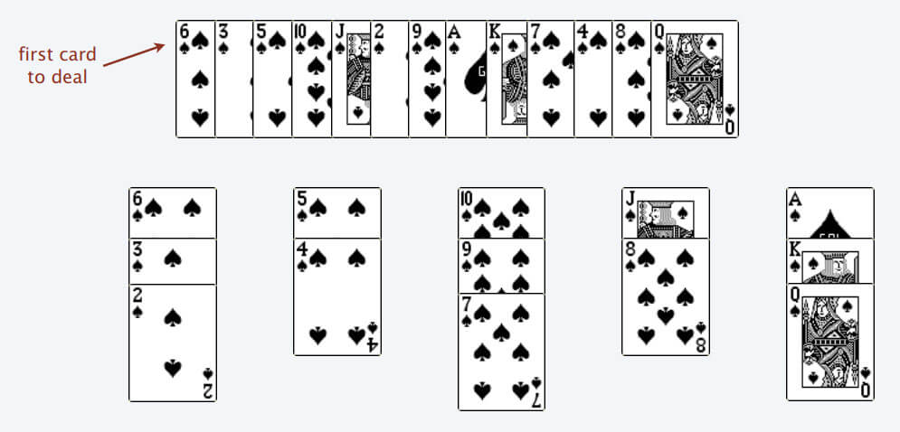
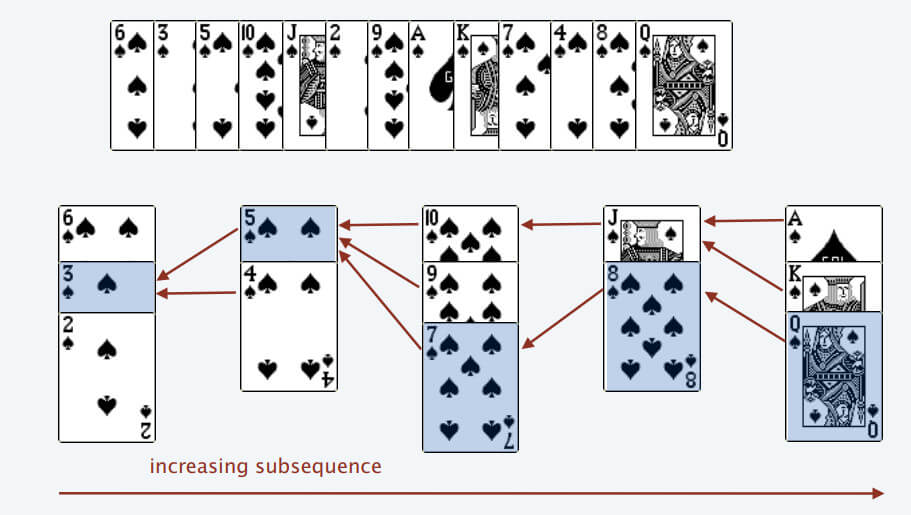

## 关键点

-   明确 状态 [变化]
-   定义 dp 数组/函数
-   明确 选择
-   明确 base case

## 数学归纳法

-   我们先假设这个结论在 k < n 时成立，
-   然后根据这个假设，想办法推导证明出 k = n 的时候此结论也成立
-   果能够证明出来，那么就说明这个结论对于 k 等于任何数都成立

## 题

### 斐波那契数 [509.]

### 零钱竞换 [322.]

### 最长递增子序列 [300.]

-   O(N^2)
-   二分化 O(NlogN)

首先定义 dp[i] -> 以 num[i]这个数结尾的 最长递增序列长度

> 这是解决子序列问题的一个套路，后文 动态规划之子序列问题解题模板 总结了几种常见套路。你读完本章所有的动态规划问题，就会发现 dp 数组的定义方法也就那几种

base case
dp[i] = 1

（子序列的最大长度）应该是 dp 数组中的最大值。

```py
res = 0
n = len(nums)
dp = [1] * n

for i in range(n):
    res = max(res, dp[i])
```

怎么设计算法逻辑来正确计算每个 dp[i] 呢？--> 状态转移


我们只要找到前面那些结尾比 3 小的子序列，然后把 3 接到这些子序列末尾，就可以形成一个新的递增子序列，而且这个新的子序列长度加一。

**二分化**

只能把点数小的牌压到点数比它大的牌上；如果当前牌点数较大没有可以放置的堆，则新建一个堆，把这张牌放进去；如果当前牌有多个堆可供选择，则选择最左边的那一堆放置。


上述规则执行，可以算出最长递增子序列，牌的堆数就是最长递增子序列的长度，证明略。


