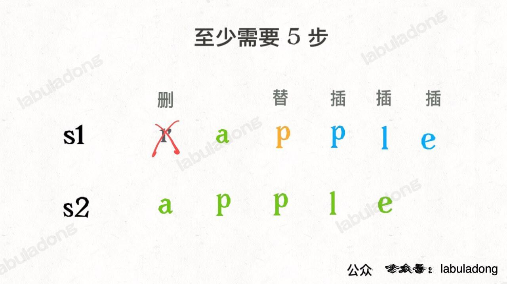
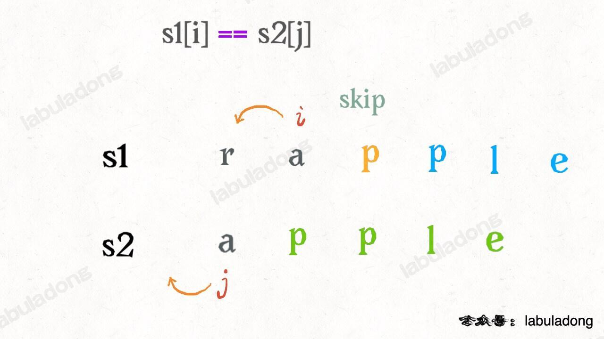
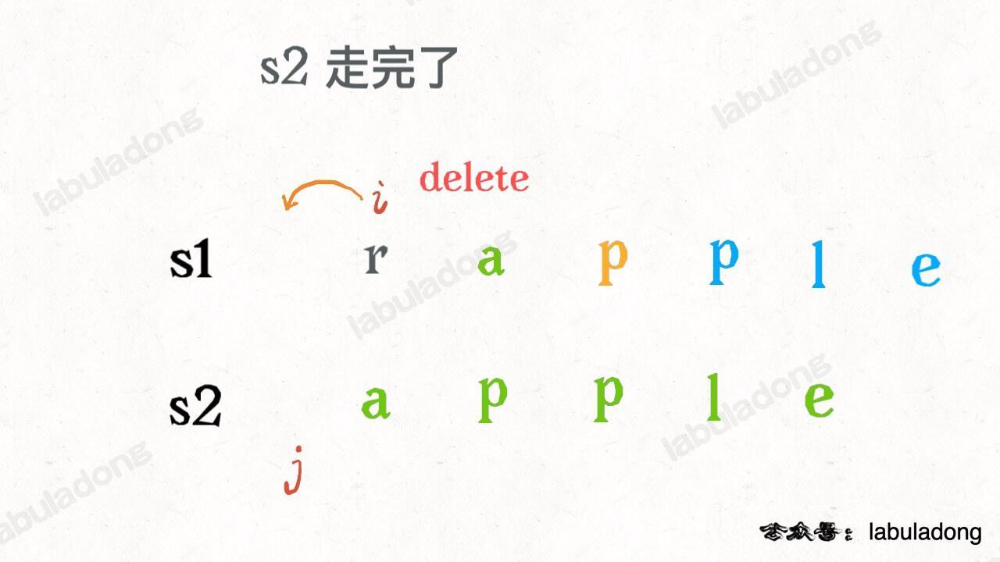
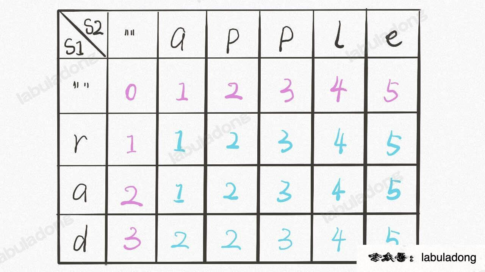

# 子序列类型问题

## 编辑距离 72.

https://labuladong.github.io/algo/3/25/75/


> 可以衡量相似度

-   解决两个字符串的动态规划问题，一般都是用两个指针 i, j 分别指向两个字符串的最后，然后一步步往前移动，缩小问题的规模。(向前亦可)

设两个字符串分别为 "rad" 和 "apple"，为了把 s1 变成 s2，算法会这样进行：




不只有三个，其实还有第四个操作，就是什么都不要做（skip



还有一个很容易处理的情况，就是 j 走完 s2 时，如果 i 还没走完 s1，那么只能用删除操作把 s1 缩短为 s2。比如这个情况



1. i 走完 s1 或 j 走完 s2

```py

if s1[i] == s2[j]:
    ...skip
    i,j 向前
else:
    三选一(全试一遍):
        insert
        delete
        replace
```

-   暴力解法
-   dp


