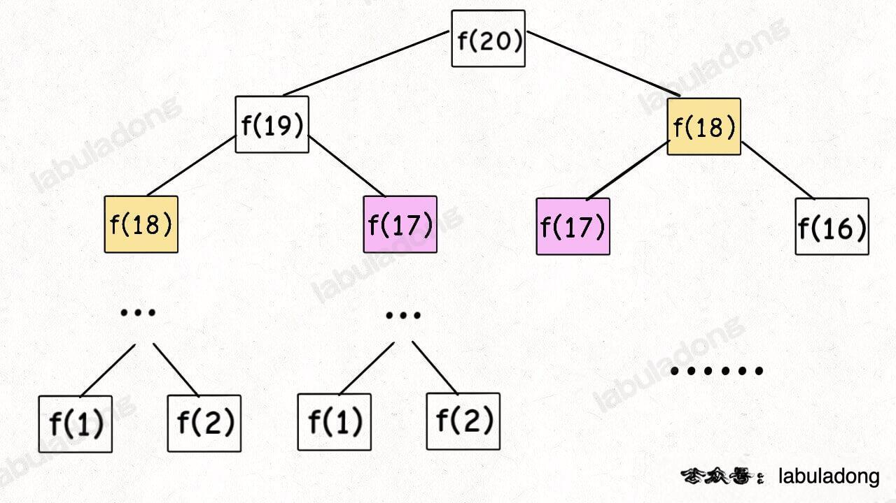
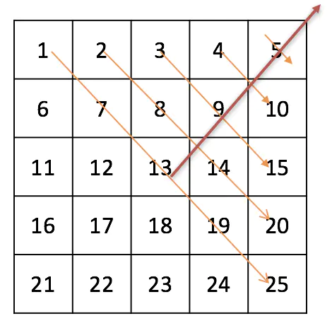
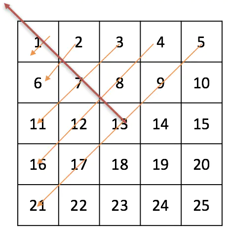

1. 到底什么才叫「最优子结构」，和动态规划什么关系。

    - 「最优子结构」是某些问题的一种特定性质，并不是动态规划问题专有的
    - 想满足最优子结，子问题之间必须互相独立

2. 如何判断一个问题是动态规划问题，即如何看出是否存在重叠子问题。

    - 最简单粗暴的方式就是画图，把递归树画出来，看看有没有重复的节点
      

3. 为什么经常看到将 dp 数组的大小设置为 n + 1 而不是 n。
4. 为什么动态规划遍历 dp 数组的方式五花八门，有的正着遍历，有的倒着遍历，有的斜着遍历。
   正向

```java
int[][] dp = new int[m][n];
for (int i = 0; i < m; i++)
    for (int j = 0; j < n; j++)
        // 计算 dp[i][j]
```

反向

```java
for (int i = m - 1; i >= 0; i--)
    for (int j = n - 1; j >= 0; j--)
        // 计算 dp[i][j]

```

斜向



```py
n = len(dp)
'''
i:
0...n-1
0...n-2
0...n-3

j: l + i
'''
for l in range(1, n):
	for i in range(n - l):
		j = l + i
		dp[i][j] .....
```



```py
n = len(A)
for i in range(n):
  k = n - i - 1
  for j in range(n-i):
    print(A[j][k])
    k -= 1
```
