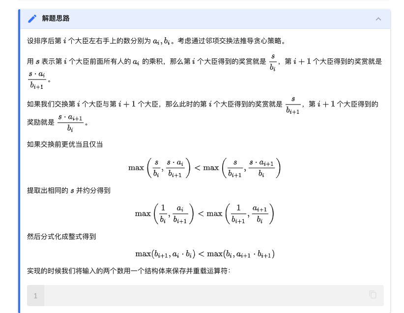

https://oi-wiki.org/basic/greedy/

- 贪心算法在有**最优子结构**的问题中尤为有效。最优子结构的意思是问题能够分解成子问题来解决，子问题的最优解能递推到最终问题的最优解。1

## 证明方法

贪心算法有两种证明方法：反证法和归纳法。一般情况下，一道题只会用到其中的一种方法来证明。

- *反证法*：如果交换方案中任意两个元素/相邻的两个元素后，答案不会变得更好，那么可以推定目前的解已经是最优解了。
- *归纳法*：先算得出边界情况（例如n=1）的最优解$F_1$，然后再证明：对于每个$n$，$F_(n+1)$都可以由$F_n$推导出结果。

## 常见题型¶

在提高组难度以下的题目中，最常见的贪心有两种。

- 「我们将 XXX 按照某某顺序排序，然后按某种顺序（例如从小到大）选择。」。
- 「我们每次都取 XXX 中最大/小的东西，并更新 XXX。」（有时「XXX 中最大/小的东西」可以优化，比如用优先队列维护）
二者的区别在于一种是离线的，先处理后选择；一种是在线的，边处理边选择。

## 邻项交换法的例题

恰逢 H 国国庆，国王邀请 n 位大臣来玩一个有奖游戏。首先，他让每个大臣在左、右手上面分别写下一个整数，国王自己也在左、右手上各写一个整数。然后，让这 n 位大臣排成一排，国王站在队伍的最前面。排好队后，所有的大臣都会获得国王奖赏的若干金币，每位大臣获得的金币数分别是：排在该大臣前面的所有人的左手上的数的乘积除以他自己右手上的数，然后向下取整得到的结果。

国王不希望某一个大臣获得特别多的奖赏，所以他想请你帮他重新安排一下队伍的顺序，使得获得奖赏最多的大臣，所获奖赏尽可能的少。注意，国王的位置始终在队伍的最前面。

TODO: 看不懂

