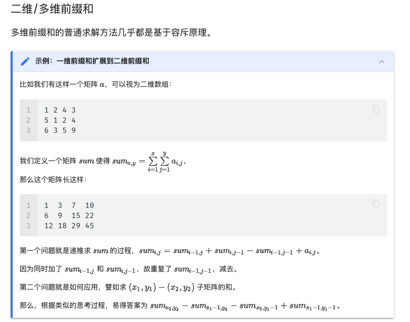

## 前缀和¶

https://oi-wiki.org/basic/prefix-sum/

前缀和是一种重要的预处理，能大大降低查询的时间复杂度。可以简单理解为“数列的前$n$项的和”。

C++ 标准库中实现了前缀和函数 std::partial_sum，定义于头文件 <numeric> 中。

### 例题

有$N$个的正整数放到数组$A$里，现在要求一个新的数组 ，新数组的第$i$个数$B[i]$是原数组$A$第 0 到第$i$个数的和。

输入：

```
5
1 2 3 4 5
```

输出:

```
1 3 6 10 15
```

## 二维/多维前缀和

多维前缀和的普通求解方法几乎都是基于*容斥原理*。

> 在计数时，必须注意没有重复，没有遗漏。为了使重叠部分不被重复计算，人们研究出一种新的计数方法，这种方法的基本思想是：先不考虑重叠的情况，把包含于某内容中的所有对象的数目先计算出来，然后再把计数时重复计算的数目排斥出去，使得计算的结果既无遗漏又无重复，这种计数的方法称为容斥原理



## 基于 DP 计算高维前缀和

基于容斥原理来计算高维前缀和的方法，其优点在于形式较为简单，无需特别记忆，但当维数升高时，其复杂度较高。这里介绍一种基于 DP 计算高维前缀和的方法。该方法即通常语境中所称的 高维前缀和。

TODO: 看不懂，过

## 树上前缀和¶


TODO: 

设$sum_i$表示结点$i$到根节点的权值总和。
然后：

-   若是点权$x,y$路径上的和为 $sum_x +sum_y - sum_{lca} - sum_{fa_{lca}}$。
-   若是边权$x,y$路径上的和为$sum_x+sum_y - 2sum_{lca}$。

LCA 的求法参见 [最近公共祖先](https://oi-wiki.org/graph/lca/)。


## 差分


差分是一种和前缀和相对的策略，可以当做是求和的逆运

这种策略的定义是令

$$
b_i =\left\{\begin{matrix}
 a_i - a_{i-1} , & i \in [2,n] \\
 a_1 , & i =1
\end{matrix}\right.
$$


简单性质：

- $a_i$的值是$b_i$的前缀和，即 $a_n =\sum_{i=1}^n b_i $
- 计算$a_i$的前缀和 
$$
sum = \sum_{i=1}^n a_i = \sum_{i=1}^{n}\sum_{j=1}^{i} b_j = \sum_i^n (n-i +1)b_i
$$
它可以维护多次对序列的一个区间加上一个数，并在最后询问某一位的数或是多次询问某一位的数。注意修改操作一定要在查询操作之前。
