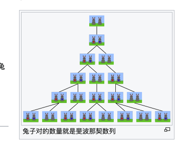
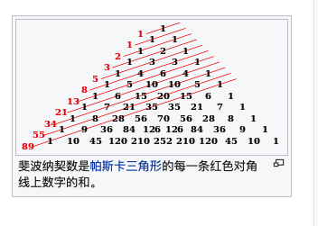

https://zh.wikipedia.org/wiki/%E6%96%90%E6%B3%A2%E9%82%A3%E5%A5%91%E6%95%B0

斐波那契数（意大利语：Successione di Fibonacci），又译为菲波拿契数、菲波那西数、斐氏数、黄金分割数。所形成的数列称为斐波那契数列（意大利语：Successione di Fibonacci），又译为菲波拿契数列、菲波那西数列、斐氏数列、黄金分割数列。

在数学上，斐波那契数是以递归的方法来定义：

$$
{\displaystyle F_{0}=0}
$$

$$
{\displaystyle F_{1}=1}
$$

$$
{\displaystyle F_{n}=F_{n-1}+F_{n-2}}（n≧2）
$$

用文字来说，就是斐波那契数列由 0 和 1 开始，之后的斐波那契数就是由之前的两数相加而得出。首几个斐波那契数是：

##用计算机求解
- 可通过编程观察斐波那契数列。分为两类问题，一种已知数列中的某一项，求序数。第二种是已知序数，求该项的值。
- 可通过递归递推的算法解决此两个问题。 事实上当n相当巨大的时候，O（n）的递推/递归非常慢……这时候要用到矩阵快速幂这一技巧，可以使递归加速到O(logn)。