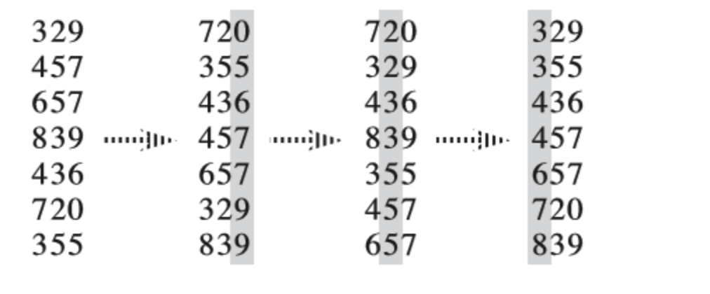
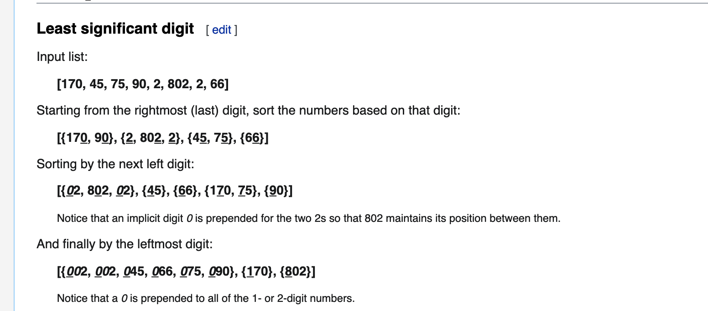
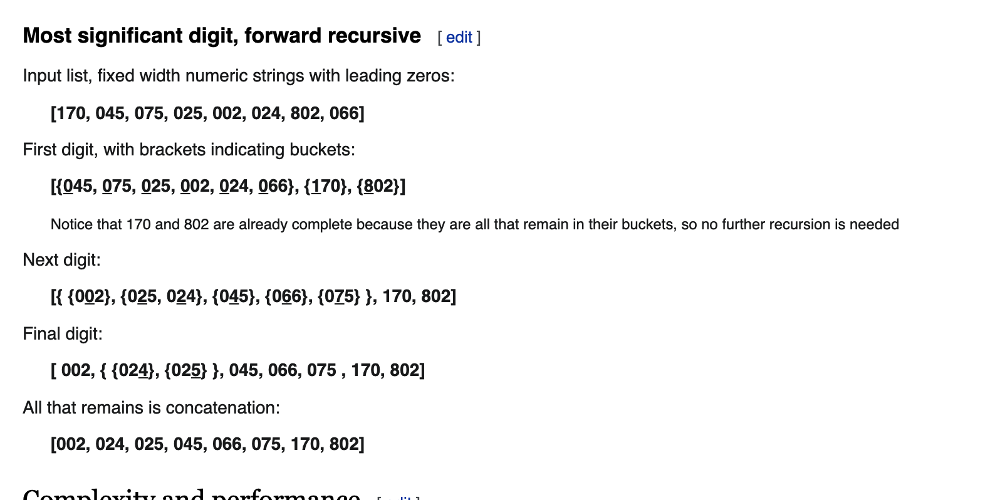
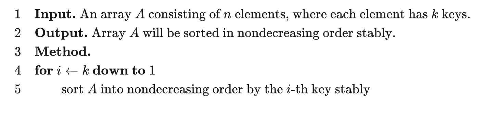

# 基数排序

https://oi-wiki.org/basic/radix-sort/
https://en.wikipedia.org/wiki/Radix_sort
https://stackabuse.com/radix-sort-in-python/
https://www.geeksforgeeks.org/radix-sort/

基数排序（英语：Radix sort）是一种非比较型的排序算法，最早用于解决卡片排序的问题。

它的工作原理是将待排序的元素拆分为 k 个关键字（比较两个元素时，先比较第一关键字，如果相同再比较第二关键字……），然后先对第 k 关键字进行稳定排序，再对第 k-1 关键字进行稳定排序，再对第 k-2 关键字进行稳定排序……最后对第一关键字进行稳定排序，这样就完成了对整个待排序序列的稳定排序。

For this reason, radix sort has also been called bucket sort and digital sort.
基数排序也是一种桶排序。桶排序是按值区间划分桶，基数排序是按数位来划分；基数排序可以看做是多轮桶排序，每个数位上都进行一轮桶排序。

基数排序需要借助一种 稳定算法 完成内层对关键字的排序。

通常而言，基数排序比基于比较的排序算法（比如快速排序）要快。但由于需要额外的内存空间，因此当**内存空间稀缺**时，原地置换算法（比如快速排序）或许是个更好的选择。1

基数排序的正确性可以参考 《算法导论（第三版）》第 8.3-3 题的解法 或自行理解。

## Why Use Counting Sort in the Radix Sort?

Counting sort is a stable, non-comparative sorting algorithm, and it is mainly used to sort integer arrays. All of these characteristics are important for its use in Radix Sort. You can use other algorithms as the subroutine, as long as they have these characteristics, though, Counting Sort is the most natural matchup.

Radix Sort needs to maintain a relative order of elements with the same key values in the input array while sorting the same place value digits, therefore, our main subroutine by definition needs to be some sort of stable sorting algorithm:

-   稳定
-   一般来说，如果每个关键字的值域都不大，就可以使用 _计数排序_ 作为内层排序，此时的复杂度为 $O(kn + \sum^{k}_{i=1}w_i)$，其中 k 为关键字数量, $w_i$ 为第 i 关键字的值域大小。如果关键字值域很大，就可以直接使用基于比较的 $O(nk\log{n})$ 排序而无需使用基数排序了。
-   空间 $O(k+n)$

