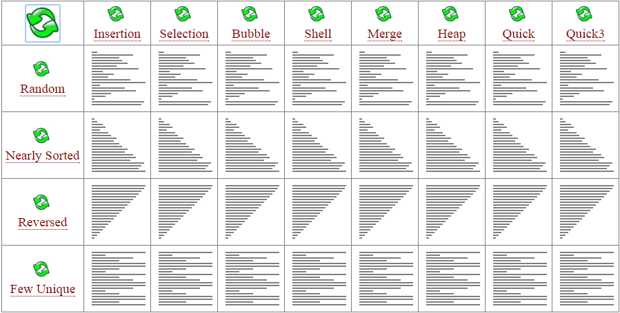
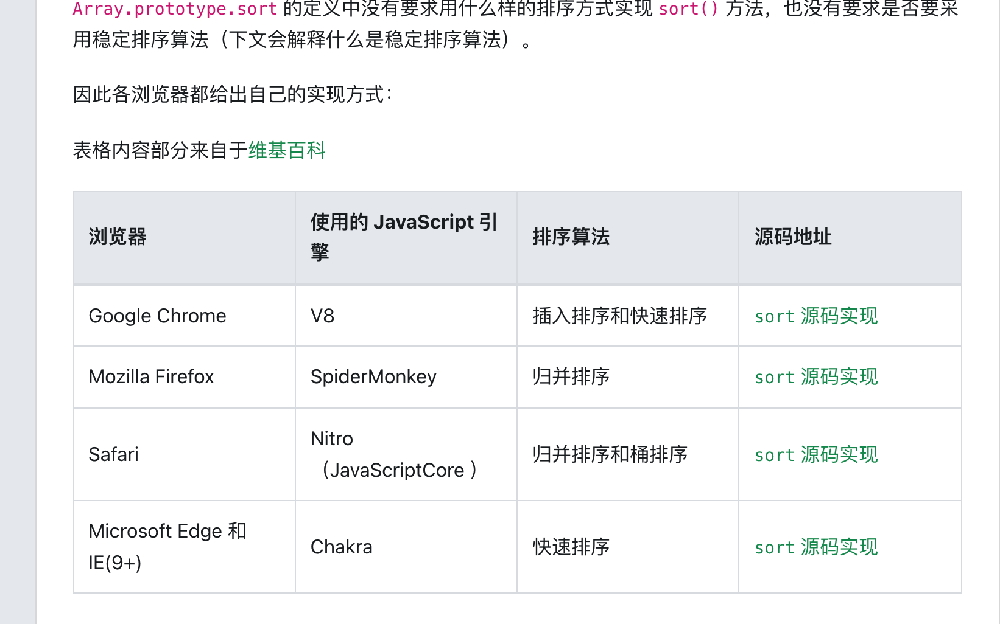

https://oi-wiki.org/basic/sort-intro/

## 稳定性

稳定性是指相等的元素经过排序之后相对顺序是否发生了改变。

拥有稳定性这一特性的算法会让原本有相等键值的纪录维持相对次序，即如果一个排序算法是稳定的，当有两个相等键值的纪录 R 和 S，且在原本的列表中 R 出现在 S 之前，在排序过的列表中 R 也将会是在 S 之前。

稳定排序:

基数排序、计数排序、插入排序、冒泡排序、归并排序

非稳定排序:

选择排序、堆排序、快速排序

## 时间复杂度

时间复杂度分为最优时间复杂度、平均时间复杂度和最坏时间复杂度。OI 竞赛中要考虑的一般是最坏时间复杂度，因为它代表的是算法运行水平的下界，在评测中不会出现更差的结果了。

基于比较的排序算法的时间复杂度下限是$O(nlogn)$的。

## 空间复杂度

与时间复杂度类似，空间复杂度用来描述算法空间消耗的规模。一般来说，空间复杂度越小，算法越好。

| 浏览器                   | 使用的 JavaScript 引擎   | 排序算法           | 源码地址                                                                                                                                                                                                                                                |
| ------------------------ | ------------------------ | ------------------ | ------------------------------------------------------------------------------------------------------------------------------------------------------------------------------------------------------------------------------------------------------- |
| Google Chrome            | V8                       | 插入排序和快速排序 | [`sort` 源码实现](https://link.segmentfault.com/?enc=npj6FN4ZUG3gBmfzi3wTNQ%3D%3D.x28glwe3jCURnRQvRdM3GgvJiW123A%2FLM9V3bczDz7E5KEMfewWXQWDX82Cb%2FRr7k58YgaUf0SR4WeLbKyo%2F9Q%3D%3D)                                                                   |
| Mozilla Firefox          | SpiderMonkey             | 归并排序           | [`sort` 源码实现](https://link.segmentfault.com/?enc=zAAi0Gi0UPpZ%2FsXJEHnr%2Fw%3D%3D.3FBifeF5%2FU5oyU8P5WYX14Hr%2Fj3eZBuBQVOkZhNU0fsaSwezIKdUI9FVLnecXw7z6RKBrjv30dEcufhmNy%2F8cbncJyp1iL%2FVxelmfMzVWF4%3D)                                           |
| Safari                   | Nitro（JavaScriptCore ） | 归并排序和桶排序   | [`sort` 源码实现](https://link.segmentfault.com/?enc=xnPRgAMPROSyeQoKUcpw7g%3D%3D.Et56qnhVXxZcajLSqaBEvZBakzqKv7NAyg9izMgpNUqaOGnMC5lVKLOQUwc%2BmwdL7EZsLbQE23RE8Z6%2Bmv21gIrJ%2FNNTrijpVCKJu7%2BFYh3Qf6Rxv7jdPPaosBdaPJvpsWxrkbyPtJnnqqFdtXqvDg%3D%3D) |
| Microsoft Edge 和 IE(9+) | Chakra                   | 快速排序           | [`sort` 源码实现](https://link.segmentfault.com/?enc=0HBlNZZ6t%2BinZZqSwcL4aw%3D%3D.M2oSgqpaQ5UBTsBwDe7vueWEa%2B35d7AYy23gtgGgwFtm4J2aP3UBw%2BDCEYwhfWyjMnoIz4nL7pn8N04ng7WPRQwFuIw6B5ird9jarySQm2924dJkjq%2BZdtGgAqCcCTeb)                             |

