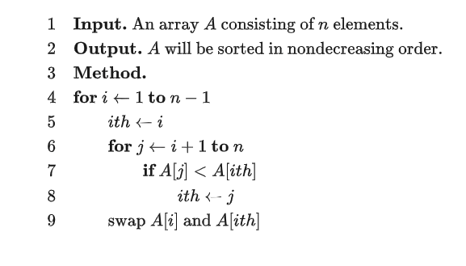

## 选择排序

(英语：Selection sort）是一种简单直观的排序算法。它的工作原理是每次找出第 小的元素（也就是 中最小的元素），然后将这个元素与数组第 个位置上的元素交换。

-   非稳定性 由于 swap（交换两个元素）操作的存在 [不一定 https://www.zhihu.com/question/20926405]
-   时间复杂度 $O(n^2)$



```python
# Python Version
def selection_sort(a, n):
    for i in range(1, n):
        ith = i
        for j in range(i + 1, n + 1):
            if a[j] < a[ith]:
                ith = j
        a[i], a[ith] = a[ith], a[i]

```
