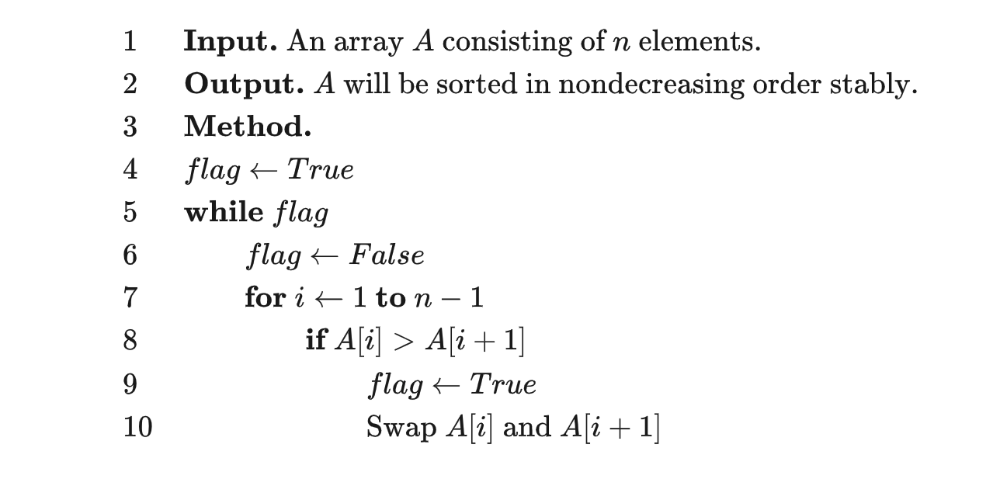

https://oi-wiki.org/basic/bubble-sort/

由于在算法的执行过程中，较小的元素像是气泡般慢慢「浮」到数列的顶端，故叫做冒泡排序。

**工作原理**:

它的工作原理是每次检查相邻两个元素，如果前面的元素与后面的元素满足给定的排序条件，就将相邻两个元素交换。当没有相邻的元素需要交换时，排序就完成了。

经过 i 次扫描后，数列的末尾 i 项必然是最大的 i 项，因此冒泡排序最多需要扫描 n-1 遍数组就能完成排序。

-   稳定

**复杂度**:

-   在序列完全有序时, 不用执行任何交换操作: O(n)
-   是坏情况操作数 $\frac{(n-1)^n}2$, 复杂度 $O(n^2)$
-   平均 $O(n^2)$



```py
# Python Version
def bubble_sort(a, n):
    flag = True
    while flag:
        flag = False
        for i in range(1, n):
            if a[i] > a[i + 1]:
                flag = True
                a[i], a[i + 1] = a[i + 1], a[i]
```
