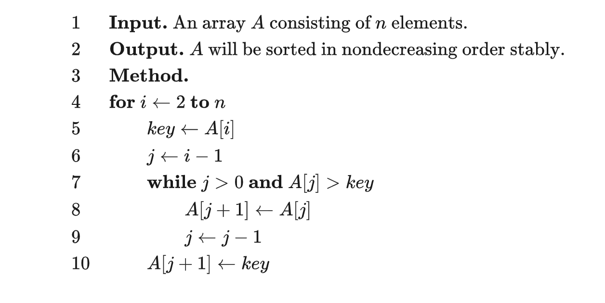

插入排序

的工作原理为将待排列元素划分为“已排序”和“未排序”两部分，每次从“未排序的”元素中选择一个插入到“已排序的”元素中的正确位置。


-   稳定
-   插入排序的最优时间复杂度为$O(n)$，在数列几乎有序时效率很高。
-   插入排序的最坏时间复杂度和平均时间复杂度都为$O(n^2)$。



```py
# Python Version
def insertion_sort(a, n):
    for i in range(2, n + 1):
        cur = a[i]
        j = i - 1
        while j > 0 and a[j] > cur:
            a[j + 1] = a[j]
            j = j - 1
        a[j + 1] = cur
```
