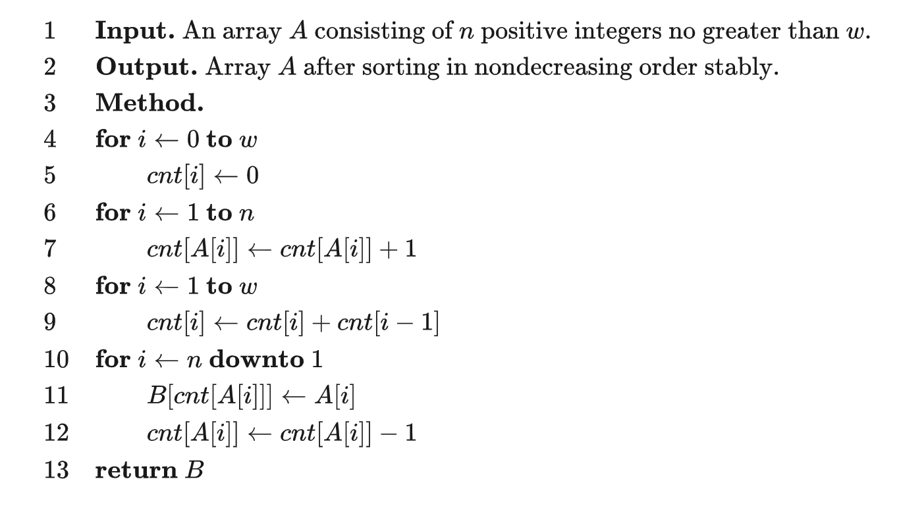

# 计数排序

https://oi-wiki.org/basic/counting-sort/

计数排序（英语：Counting sort）是一种线性时间的排序算法。

## 工作原理

计数排序的工作原理是使用一个额外的数组 C，其中第 i 个元素是待排序数组 A 中值等于 i 的元素的个数，然后根据数组 C 来将 A 中的元素排到正确的位置。

它的工作过程分为三个步骤：

-   计算每个数出现了几次；
-   求出每个数出现次数的 [前缀和](https://oi-wiki.org/basic/prefix-sum/)；
-   利用出现次数的前缀和，从右至左计算每个数的排名。

**oi-wiki**上面有点问题，下面是 wiki 上的

-   找出待排序的数组中最大和最小的元素
-   统计数组中每个值为 i 的元素出现的次数，存入数组 C 的第 i 项
-   对所有的计数累加（从 C 中的第一个元素开始，每一项和前一项相加）
-   反向填充目标数组：将每个元素 i 放在新数组的第 C[i]项，每放一个元素就将 C1 减去 1

-   稳定
-   时间复杂度 O(n+w), 其中 w 为待排序数据的值域大小。

