# 计数排序

https://oi-wiki.org/basic/counting-sort/

计数排序（英语：Counting sort）是一种线性时间的排序算法。

## 工作原理

计数排序的工作原理是使用一个额外的数组 C，其中第 i 个元素是待排序数组 A 中值等于 i 的元素的个数，然后根据数组 C 来将 A 中的元素排到正确的位置。

它的工作过程分为三个步骤：

-   计算每个数出现了几次；
-   求出每个数出现次数的 [前缀和](https://oi-wiki.org/basic/prefix-sum/)；
-   利用出现次数的前缀和，从右至左计算每个数的排名。



-   稳定
-   时间复杂度 O(n+w), 其中 w 为待排序数据的值域大小。


```py
# Python Version
N = W = 100010
n = w = 0
a = b = [0] * N
cnt = [0] * W

def counting_sort():
    for i in range(1, n + 1):
        cnt[a[i]] += 1
    for i in range(1, w + 1):
        cnt[i] += cnt[i - 1]
    for i in range(n, 0, -1):
        b[cnt[a[i]] - 1] = a[i]
        cnt[a[i]] -= 1
```
