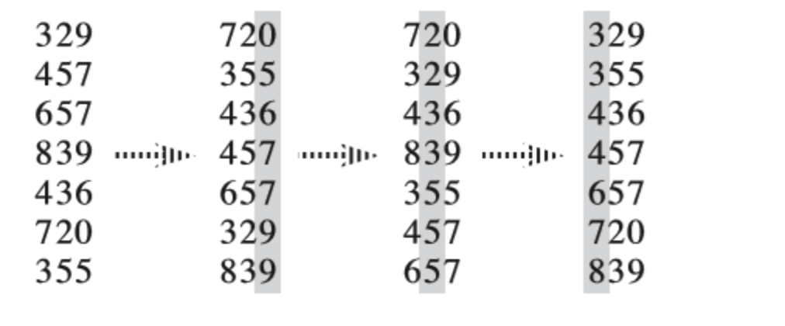
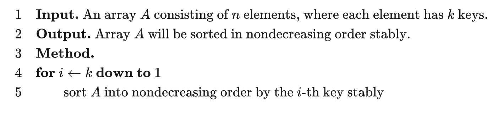

# 基数排序

https://oi-wiki.org/basic/radix-sort/

基数排序（英语：Radix sort）是一种非比较型的排序算法，最早用于解决卡片排序的问题。

它的工作原理是将待排序的元素拆分为 k 个关键字（比较两个元素时，先比较第一关键字，如果相同再比较第二关键字……），然后先对第 k 关键字进行稳定排序，再对第 k-1 关键字进行稳定排序，再对第 k-2 关键字进行稳定排序……最后对第一关键字进行稳定排序，这样就完成了对整个待排序序列的稳定排序。



基数排序需要借助一种 稳定算法 完成内层对关键字的排序。

通常而言，基数排序比基于比较的排序算法（比如快速排序）要快。但由于需要额外的内存空间，因此当**内存空间稀缺**时，原地置换算法（比如快速排序）或许是个更好的选择。1

基数排序的正确性可以参考 《算法导论（第三版）》第 8.3-3 题的解法 或自行理解。


- 稳定
- 一般来说，如果每个关键字的值域都不大，就可以使用 *计数排序* 作为内层排序，此时的复杂度为 O(kn + \sum{k}{i=1}w_i)，其中$w_i$为第i关键字的值域大小。如果关键字值域很大，就可以直接使用基于比较的O(nklogn)排序而无需使用基数排序了。
- 空间 O(k+n)




```cpp
const int N = 100010;
const int W = 100010;
const int K = 100;

int n, w[K], k, cnt[W];

struct Element {
  int key[K];

  bool operator<(const Element& y) const {
    // 两个元素的比较流程
    for (int i = 1; i <= k; ++i) {
      if (key[i] == y.key[i]) continue;
      return key[i] < y.key[i];
    }
    return false;
  }
} a[N], b[N];

void counting_sort(int p) {
  memset(cnt, 0, sizeof(cnt));
  for (int i = 1; i <= n; ++i) ++cnt[a[i].key[p]];
  for (int i = 1; i <= w[p]; ++i) cnt[i] += cnt[i - 1];
  // 为保证排序的稳定性，此处循环i应从n到1
  // 即当两元素关键字的值相同时，原先排在后面的元素在排序后仍应排在后面
  for (int i = n; i >= 1; --i) b[cnt[a[i].key[p]]--] = a[i];
  memcpy(a, b, sizeof(a));
}

void radix_sort() {
  for (int i = k; i >= 1; --i) {
    // 借助计数排序完成对关键字的排序
    counting_sort(i);
  }
}
```