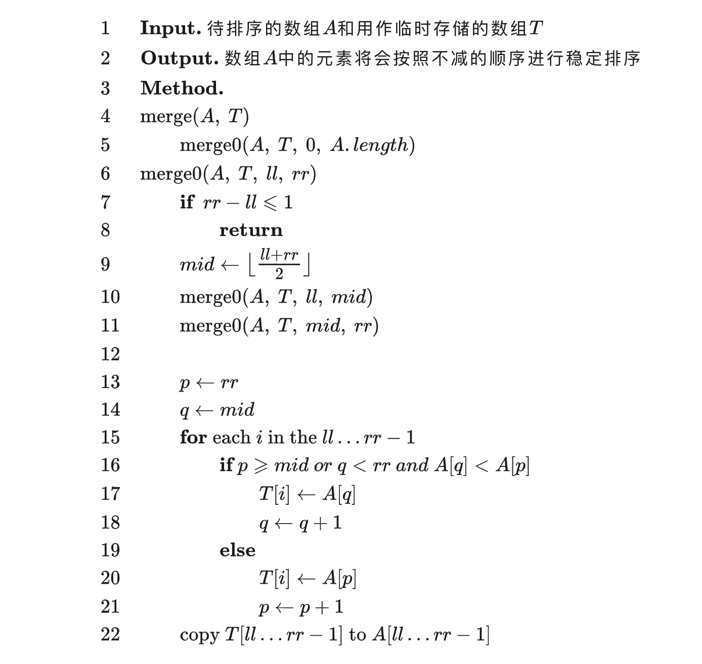

# 归并排序


归并排序（英语：merge sort）是一种采用了 分治 思想的排序算法。


## 工作原理
归并排序分为三个步骤：

- 将数列划分为两部分；
- 递归地分别对两个子序列进行归并排序；
- 合并两个子序列。

不难发现，归并排序的前两步都很好实现，关键是如何合并两个子序列。注意到两个子序列在第二步中已经保证了都是有序的了，第三步中实际上是想要把两个**有序**的序列合并起来。


- 归并排序是一种稳定的排序算法。
- 归并排序的最优时间复杂度、平均时间复杂度和最坏时间复杂度均为O(nlogn)。
- 归并排序的空间复杂度为 O(n)。




```python
# Python Version
def merge_sort(ll, rr):
    if rr - ll <= 1:
        return
    mid = math.floor((rr + ll) / 2)
    merge_sort(ll, mid)
    merge_sort(mid, rr)
    p = s = ll
    q = mid
    while(s < rr):
        if p >= mid or (q < rr and a[p] > a[q]):
            s += 1
            q += 1
            t[s] = a[q]
        else:
            s += 1
            p += 1
            t[s] = a[p]
    for i in range(ll, rr):
        a[i] = t[i]
```


## 逆序对
TODO:  https://oi-wiki.org/basic/merge-sort/#_6