## 前言

1. 表名 首字母大写 Accounts BugsProducts
2. 列 小写下划线 account_name

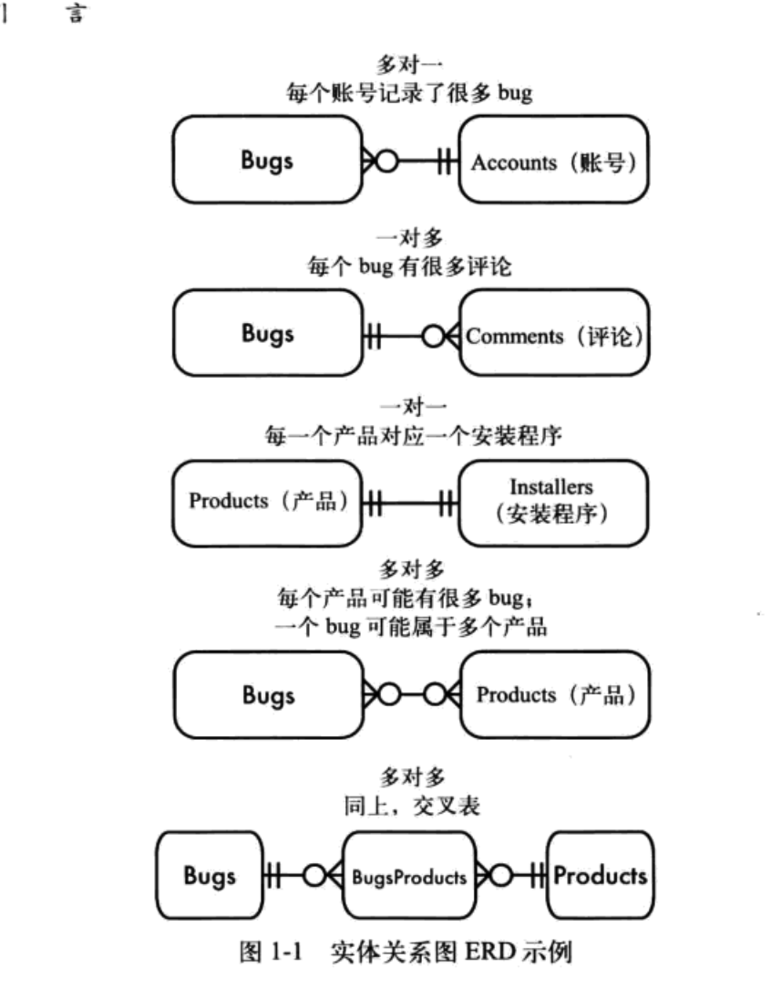

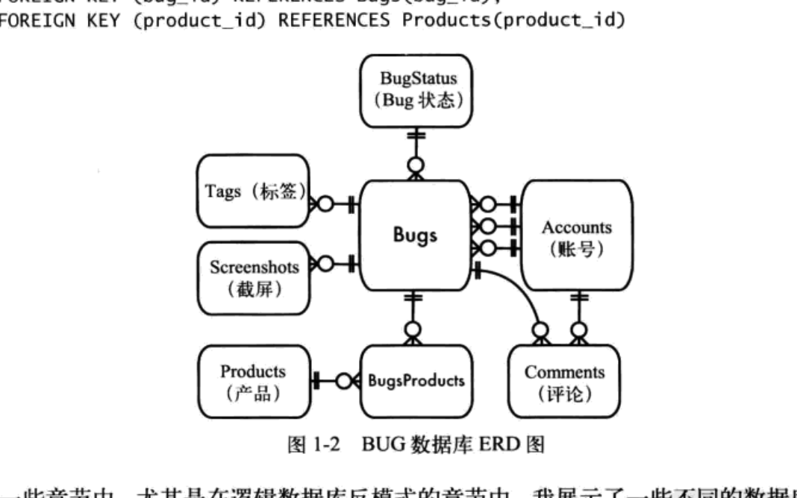

## 逻辑型反模式

### 乱穿马路

逗号表达式

查询指定产品帐号

```sql
SELECT * FROM Products As p JOIN Accounts AS a
  ON p.account_id REGEXP '[[:<:]]' || a.account_id || '[[:>:]]'
WHERE p.product_id = 123;
```

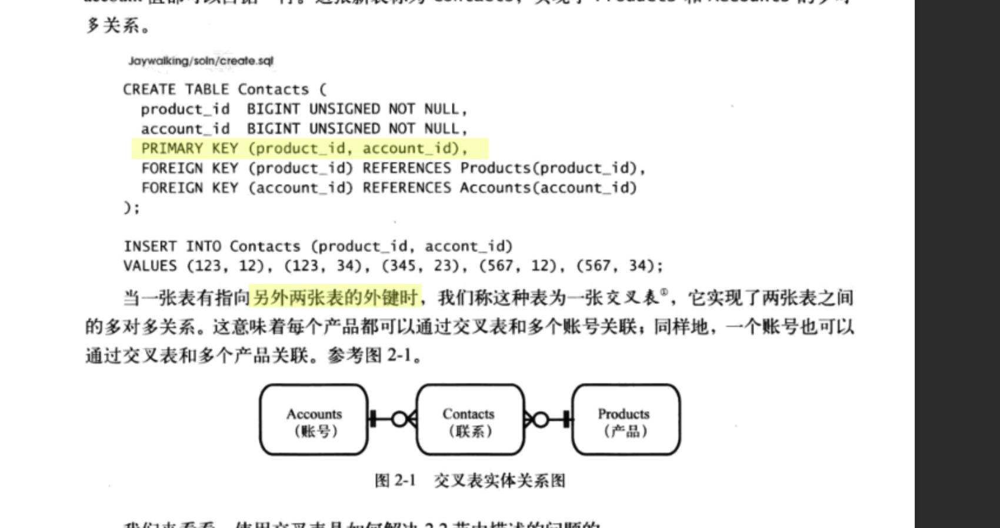

===> 交叉表

```sql
CREATE TABLE Contacts (
  product_id BIGINT UNSIGNED NOT NULL,
  account_id BIGINT UNSIGNED NOT NULL,
  PRIMARY KEY (product_id, account_id),
  FOREIGN KEY (product_id) REFERENCES Products(product_id),
  FOREIGN KEY (account_id) REFERENCES Accounts(account_id)
);
```

指定帐号的产品的所有属性

```sql
SELECT * from Products as p JOIN Contacts as c
  ON (p.account_id = c.account_id)
  WHERE c.product_id = 34;
```

帐号细节

```sql
SELECT a.*
FROM Accounts AS a JOIN Contacts AS c
ON (a.account_id = c.account_id)
WHERE c.product_id = 34;
```

每个产品下的帐号数量

```sql
SELECT product_id, COUNT(*) AS accounts_per_product
FROM Contacts
GROUP BY product_id;
```

每个帐号下产品数

```sql
SELECT account_id, COUNT(*) AS accounts_per_product
FROM Contacts
GROUP BY account_id;
```

关联帐号最多产品

```sql
SELECT product_id, COUNT(*) AS accounts_per_product
FROM Contacts
GROUP BY product_id;
```

帐号最多的产品 TODO:xxx

```sql
SELECT c.product_id, c.account_per_product

FROM (
  SELECT product_id, COUNT(*) AS accounts_product
  FROM Contacts
  GROUP BY product_id
) as c
HAVING c.accounts_per_product = MAX(c.accounts_per_product);
```

更新指定产品的相关联系人

```sql
INSERT INTO Contacts (product_id, account_id) VALUES (456,34);
DELETE FROM Contacts WHERE product_id = 456 AND account_id = 34;
```

### 单纯的树

评论可以评论原文， 相互评论

反

检索回复会很长

```sql
CREATE TABLE Comments(
  comment_id SERIAL PRIMARY KEY,
  parent_id BIGINT UNSIGNED,
  comment TEXT NOT NULL,
  FOREIGN KEY (parent_id) REFERENCES Comments(comment_id)
)
```

**名词**

- root
- leaf
- nonleaf

**[反] 总是依赖父节点**

邻接表
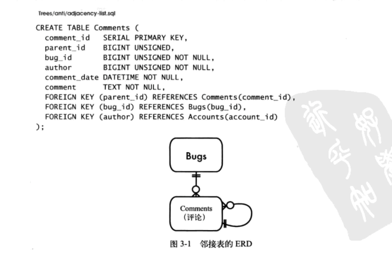
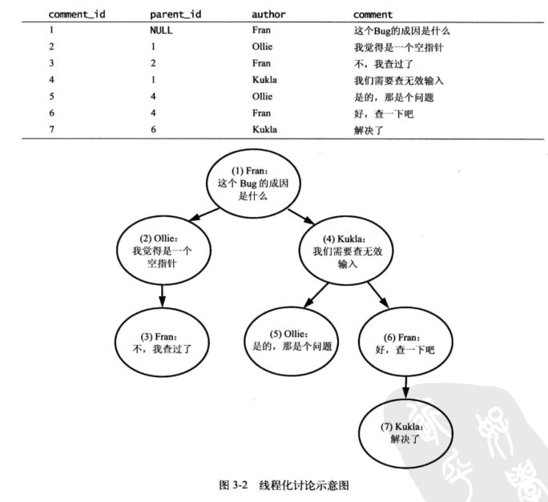

使用邻接表查询所有后代

查询两层

```sql
SELECT c1.*, c2.*
FROM Comments c1 LEFT OUTER JOIN Comments c2
  ON c2.parent_id = c1.comment_id;

```

笨拙，count() 困难

```sql
SELECT c1.*, c2.*, c3.*, c4.*
  FROM Comments c1 -- 1st level
    LEFT OUTER JOIN Comments c2
      ON c2.Parent_id =  c1.Comment_id -- 2nd level
    LEFT OUTER JOIN Comments c3
      ON c3.Parent_id c2.Comment_id -- 3rd level
    LEFT OUTER JOIN Comments c4
      ON c4.Parent_id c3.Comment_id; -- 4th level
```

一些情况下邻接表比较方便, 增加节点

```sql
UPDATE INTO Comments (bug_id, parent_id, author, comment)
  VALUES (1234, 7, 'Kukla', 'thanks')
```

更新节点位置

```sql
UPDATE SET parent_id = 3 WHERE comment_id = 6;
```

删除节点会很复杂, 目标删除 4，保证外键完整要查找所有子节点

```sql
SELECT comment_id FROM Comments WHERE parent_id = 4; -- 5,6
SELECT comment_id FROM Comments WHERE parent_id = 5; -- none
SELECT comment_id FROM Comments WHERE parent_id = 6; -- 7
SELECT comment_id FROM Comments WHERE parent_id = 7; -- none

DELETE FROM Comments WHERE comment_id IN (7);
DELETE FROM Comments WHERE comment_id IN (5,6);
DELETE FROM Comments WHERE comment_id = 4;
```

**[方案] 使用其他树模型**

目前的 MySQL、MariaDB 和主流数据库都支持 CTE 递归查询了

```sql
-- 表结构
CREATE TABLE Comments (
  comment_id SERIAL PRIMARY KEY,
  parent_id BIGINT UNSIGNED,
  author VARCHAR(20),
  content VARCHAR(255)
);

-- 插入数据
INSERT INTO Comments (comment_id, parent_id, author, content) VALUES
(1, null, 'Fran', '这个Bug的成因是什么'),
(2, 1, 'Ollie', '我觉得是一个空指针'),
(3, 2, 'Fran', '不，我查过了'),
(4, 1, 'Kukla', '我们需要查无效输入'),
(5, 4, 'Ollie', '是的，那是个问题'),
(6, 4, 'Fran', '好，查一下吧'),
(7, 6, 'Kukla', '解决了'),
(8, 7, 'Fran', '非常棒');

-- 递归查找评论id为4的所有子评论
WITH RECURSIVE cte AS (
  SELECT * FROM Comments WHERE comment_id = 4    -- 条件：评论id = 4
  UNION                                          -- 递归：父评论id为此评论id的评论
  SELECT c.* FROM Comments c JOIN cte t WHERE c.parent_id = t.comment_id
)
SELECT * FROM cte;
```

- 路径枚举
- 嵌套表
- 闭包表

**路径枚举**

邻接表从树中获取一个给定节点的所有祖先开销大， 路径枚举所有祖先联合为一个字符串

```sql
CREATE TABLE Comments (
  comment_id SERIAL PRIMARY KEY,
  path VARCHAR(1000),
  parent_id BIGINT UNSIGNED,
  author VARCHAR(20),
  comment VARCHAR(255)
  comment_date DATETIME NOT NULL,
);
```

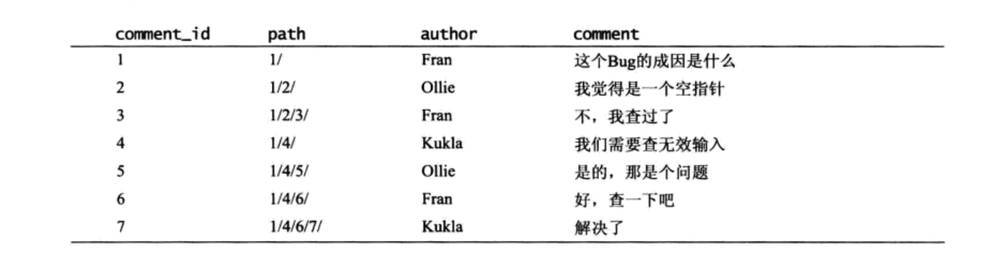

找到评论 7 的祖先

```sql

select *
from Comments As c
where '1/4/6/7/' like c.path || '%' -- 1/4/6/% , 1/4/% 1/%
```

找到评论 4 的后代

```sql
select *
from Comments As c
where c.path like '1/4/' || '%'
```

评论 4 下的每个用户的评论数量

```sql
select COUNT(*)
From Comments as c Where c.path like '1/4' || '%'
Group By c.author
```

insert

```sql
INSERT INTO Comments(author, comment) VALUES ('Ollie', 'Good Job!');

UPDATE Comments
  Set path = (Select path From Comments Where comment_id = 7)
    || LAST_INSERT_ID() || '/'
  Where comment_id = LAST_INSERT_ID()
```

存在乱穿马路的问题

**嵌套集**

```sql
CREATE TABLE Comments (
  comment_id SERIAL PRIMARY KEY,
  nsleft INTEGER NOT NULL,
  nsright INTEGER NOT NULL,
  parent_id BIGINT UNSIGNED,
  author VARCHAR(20),
  comment VARCHAR(255)
  comment_date DATETIME NOT NULL,
);
```

nsleft 的数值小于节点的所有后代 id， nsright 大于节点的所有后代

深度递归，进入时分配 nsleft, 返回时分配 nsright

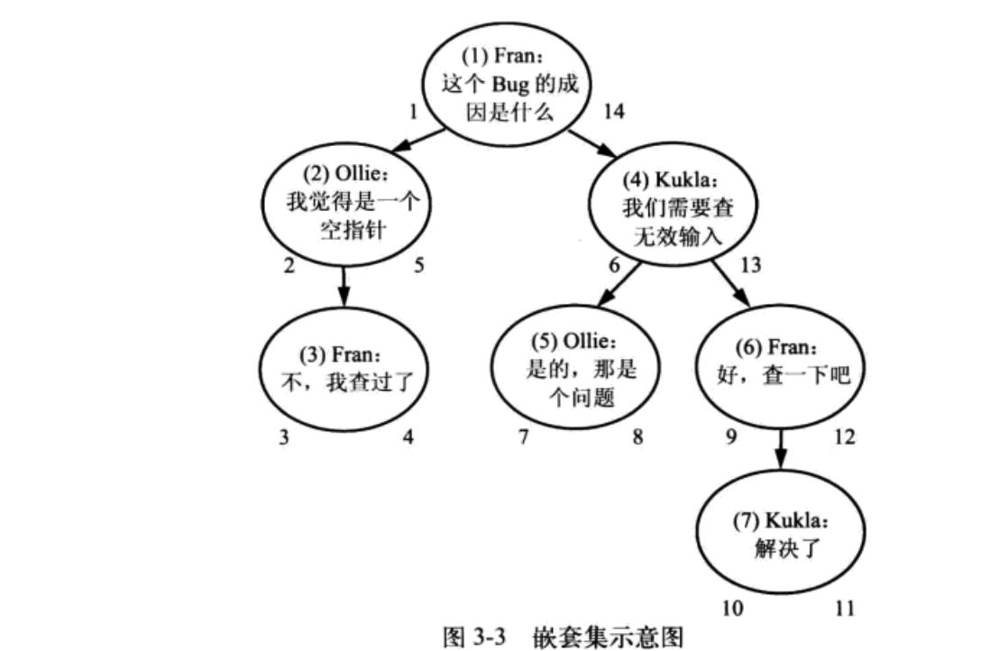
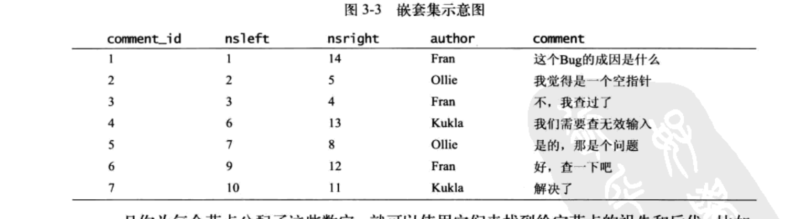

查找 #4 及其后代

```sql
SELECT c2.*
FROM Comments As c1
  JOIN Comments As c2
  ON c2.nsleft BETWEEN c1.nsleft AND c1.nsright
WHERE c1.comment_id = 4;
```

查找 #6 及其祖先

```sql
SELECT c2.*
FROM Comments As c1
  JOIN Comments As c2
  ON c1.nsleft BETWEEN c2.nsleft AND c2.nsright
WHERE c1.comment_id = 6;
```

当你要删除一个非叶子节点时，他的后代会自动代替被删除的节点，成为直接祖先的直接后代

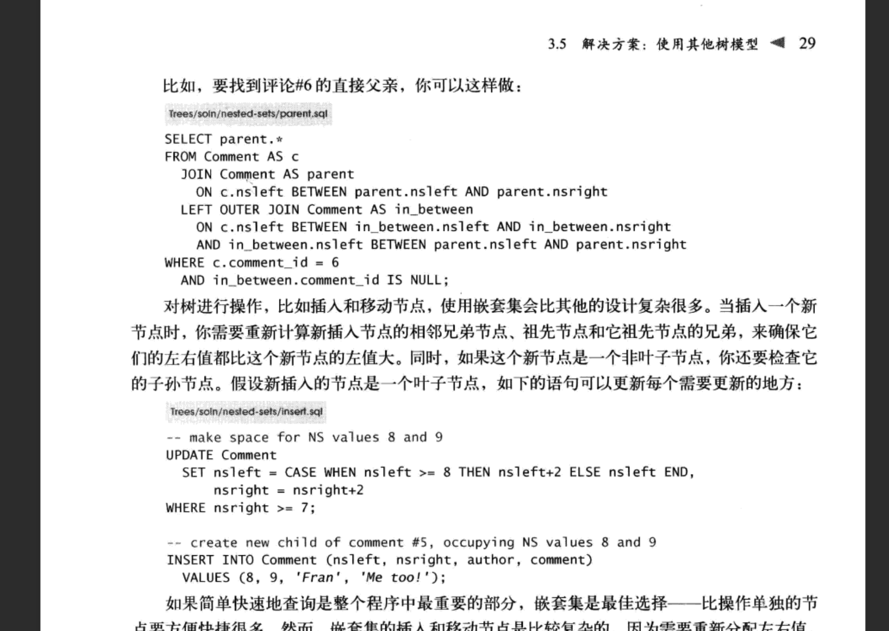

**闭包表**

```sql
CREATE TABLE Comments (
  comment_id SERIAL PRIMARY KEY,
  parent_id BIGINT UNSIGNED,
  author VARCHAR(20),
  comment VARCHAR(255)
  comment_date DATETIME NOT NULL,
);

CREATE TABLE TreePaths (
  ancestor BIGINT UNSIGNED NOT NULL,
  descendant BIGINT UNSIGNED NOT NULL,
  PRIMARY KEY (ancestor, descendant),
  FOREIGN KEY (ancestor) REFERENCES Comments(comment_id),
  FOREIGN KEY (descendant) REFERENCES Comments(comment_id)
);
```

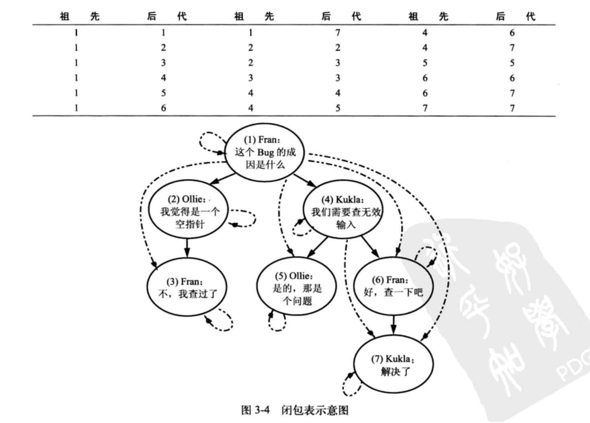

**\#4 的后代**

```sql

select c.*
from comments as c
  JOIN TreePaths as t ON c.comment_id = t.descendant
Where t.ancestor = 4
```

**\#6 的后代**

```sql
select c.*
from comments as c
  JOIN TreePaths as t ON c.comment_id = t.ancestor
Where t.descendant = 6
```

**insert**

为 5 增加一个子节点

```sql
INSERT INTO TreePaths (ancestor, descendant)
  select t.ancestor, 8
  from TreePaths as t
  where t.descendant = 5
  union all
  select 8, 8;
```

删除 7

```sql
delete from TreePaths where descendant = 7;
```

删除 4 及后代

```sql
Delete from TreePaths
Where descendant in (
  Select descendant
  From TreePaths
  Where ancestor = 4
);
```

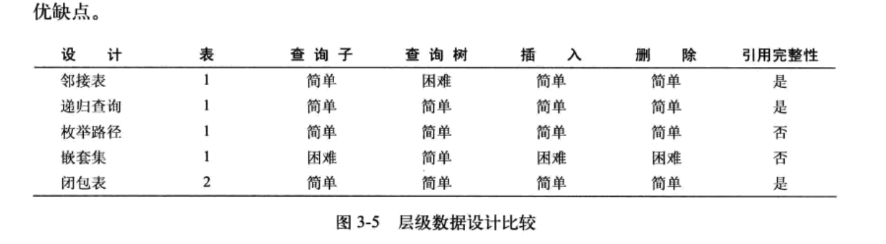

---

### 需要 ID

```sql

create table ArticleTags (
  id SERIAL primary key,
  article_id BIGINT UNSIGNED NOT NULL,
  tag_id BIGINT UNSIGNED NOT NULL,
  FOREIGN KEY (article_id) REFERENCES Articles(id)
  FOREIGN KEY (tag_id) REFERENCES Tags(id)
)


-- 查询 327 下的文章数量, 数量不对，重复关联了

Select tag_id, COUNT(*) As article_per_tag
From ArticleTags Where tag_id = 327;
```

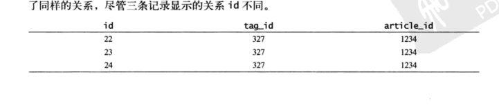

### 6.实体-属性-值 eav 模式

按日期统计记录条数

- 所有值都在同一列种
- 数据类型可以比较

```sql
SElECT date_reported, COUNT(*)
FROM Bugs
group by date_reported;
```

**老方案**

- 新增字段
  - 实现成本高，每次添加商品都需要进行前后端开发、调试，浪费时间和人力。
  - 数据库的字段可能会越来越多，而很多字段大部分商品都是不需要的，需要设置为 NULL，导致内存大量浪费。
- 预留字段 ext1 ext2 ext3

  - 字段一样，但是含义不一样，需要前端做大量适配。
  - 字段的类型可能不一样，预留字段还得考虑不同的类型。
  - 预留字段太少了作用有限，太多了和新增字段一样会有存储和性能问题。
  - 扩展字段是公用的，不能根据字段名顾名思义，得在启用时维护对应关系，使用时查找对应关系。
  - 扩展字段的数量无法精确定义。

- extra json 字段
  - JSON 数据仅仅只能用于展示，如果用于条件查询、数据更新其效率是很低的。查询时需要遍历表解析 JSON。

**[反] 使用泛型属性表**

- 实体：通常来说这就是一个指向父表的外键，父表的每条记录表示一个实体对象
- 属性：在传统的表中，属性即每一列的名字，但在这个新的设计中，我们需要根据不同的记录来解析其标识的对象属性。
- 值：对于每个实体的每一个不同属性，都有一个对应的值。 比如，一个给定的 Bug 是一个实体对象，我们通过它的主键来标识它，它的主键值

```sql

create table Issues(
  issue_id serial primary key
);

insert into Issues (issue_id) values (1234);

create table IssueAttributes(
  issue_id bigint unsigned not null,
  attr_name varchar(100) not null,
  attr_value varchar(100),
  primary key (issued_id, attr_name),
  foreign key (issue_id) references Issues(issue_id)
)


INSERT INTO IssueAttributes  (issue_id, attr_name, attr_value)
VALUES
 (1234, 'product', '1'),
 (1234, 'date reported', '2009-06-01'),
 (1234, ' status', 'NEW'),
 (1234, 'description', 'Saving does not work'),
 (1234, 'reported_by' 'Bi71').
 (1234, 'version_affected', '1.0').
 (1234, 'severity', 'loss of functionality').
 (1234, 'priority' 'high');
```

- 两张表的列都很少
- 新增的属性不会对现有的表结构造成影响，不需要新增列
- 避免了由于空值造成的表内容混乱

查询属性

```sql
-- 正常 --
select issue_id,date_reported from Issues;

-- EAV --
select issue_id, attr_value as 'date_reported'
from IssueAttributes
where attr_name = 'date_reported'
```

- 无法声明强制属性, eav 中每个属性为表中的一行，而非一列, 需要检查每个 issue_id 都存在这一行
- 无法使用数据类型, eav 中 attr_value 都是 string
- 无法保证引用的完整性
- 无法配置属性名，命名不规范时会出现多个同义的 attr_name
-

重组行，由于每个属性在 IssueAttributes 表里都存储在独立的行中，要想像上面那样按行获取所有这些属性就需要执行一个联结查询，并将结果合并成行。同时，必须在写查询语句的时候就知道所有的属性名称。下面的查询语句重组了上表展示的行：

```sql
SELECT i.Issue_id,
i1.Attr _value AS "date_reported",
i2.Attr_value AS "status",
i3.Attr_value AS "priority",
i4. Attr_value AS "description"

FROM Issues AS i

LEFT OUTER JOIN IssueAttributes AS i1
  ON i.issue_id i1.Issue_id AND i1.Attr_name ='date reported'

LEFT OUTER JOIN IssueAttributes AS i2
  ON i.issue_id i2.Issue_id AND i2.Attr_name 'status'

LEFT OUTER JOIN IssueAttributes AS i3
  ON i.issue id i3.issue id AND i3.attr name 'priority';

LEFT OUTER JOIN IssueAttributes AS i4
  ON i.issue_id i4.issue_id AND i4.attr_name 'description';

WHERE i.issue_id =1234;
```

**合理使用反模式**

在关系数据库中很难为 EAV 这个反模式正名，因为这就不得不放弃关系型范式的太多优点。但这不影响在某些程序中合理地使用这种设计来支持动态属性。

大多数应用程序仅仅在有限的几张表甚至于仅一张中需要存储无范式的数据，而其他的数据需求适用于标准的表设计。如果你明白在你的项目中使用 EAV 设计的风险和你要做的额外工作，并且谨慎地使用它，它的副作用会变得较小。但请一定要记住，那些富有经验的数据库顾问给出的报告显示，使用 EAV 设计的系统在一年以内就会变得极其笨重。

配合 MongoDB 吧

**模型化子类型**

单表继承

每张表的列数是有限的，没有限制哪个属性属于哪个类型

```sql
CREATE TABLE Issues(
  issue_id SERIAL PRIMARY KEY,
  reported_by BIGINT UNSIGNED NOT NULL,
  product_id BIGINT UNSIGNED,
  `priority` VARCHAR(20),
  version_resolvedVARCHAR (20),
  `status` VARCHAR(20),
  issue_type VARCHAR(10), -- BUG or FEATURE
  severity VARCHAR (20), -- only for bugs
  version_affected VARCHAR (20), -- only for bugs
  sponsor VARCHAR (50), -- only for feature requests
  FOREIGN KEY  (reported_by) REFERENCES Accounts(account_id),
  FOREIGN KEY  (product_id) REFERENCES Products (product_id)
);
```

实体表继承

另一个解决方案是为每个子类型创建一张独立的表。每个表包含那些属于基类的共有属性，同时也包含子类型特殊化的属性。然而，很难将通用属性和子类特有的属性区分开来。因此，如果将一个新的属性增加到通用属性中，必须为每个子类表都加一遍。

类表继承

模拟继承

```sql
CREATE TABLE Issues(
  issue_id SERIAL PRIMARY KEY,
  reported_by BIGINT UNSIGNED NOT NULL,
  product_id BIGINT UNSIGNED,
  `priority` VARCHAR(20),
  `version` resolved VARCHAR(20).
  `status` VARCHAR (20),
  FOREIGN KEY  (reported_by) REFERENCES Accounts(account_id),
  FOREIGN KEY  (product_id) REFERENCES Products(product_id),
);

CREATE TABLE Bugs(
  issue_id BIGINT UNSIGNED PRIMARY KEY,
  severity VARCHAR(20),
  version_affected VARCHAR (20),
  FOREIGN KEY  (issue_id) REFERENCES Issues(issue_id)
);

CREATE TABLE FeatureRequests(
  issue_id BIGINT UNSIGNED PRIMARY KEY.
  sponsor VARCHAR(50),
  FOREIGN KEY  (issue_id) REFERENCES Issues(issue_id)
);
```

特性表

```sql
-- 特性
CREATE TABLE Features(
  feature_id SERIAL PRIMARY KEY,
  name       VARCHAR(255) UNIQUE NOT NULL,
  comment    VARCHAR(255) NULL
);
-- 产品特性
CREATE TABLE ProductFeatures (
  product_id  BIGINT UNSIGNED NOT NULL,
  feature_id  BIGINT UNSIGNED NOT NULL,
  PRIMARY KEY (product_id, feature_id),
  FOREIGN KEY (product_id) REFERENCES Products(product_id),
  FOREIGN KEY (feature_id) REFERENCES Features(feature_id)
);
-- 当表名是变量，可采用存储过程实现，甚至可以使用循环
SET @sql = concat(
    'SELECT * FROM ',
    (SELECT name FROM features WHERE feature_id = 1)
);
PREPARE stmt FROM @sql;
EXECUTE stmt;
```

### 多态关联

Comments（评论表）可能被 Bugs（错误表）和特性表（Features）同时用到。
其实原著中有一句话我非常赞同： 当你看清楚问题的根源时，解决方案将变得异常简单：多态关联是一个反向关联。

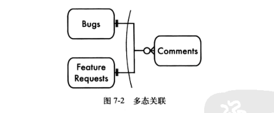
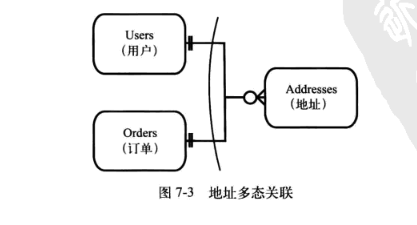

**[反]使用双用途外键**

Comments 里面多了个 type 字段说明是评论来自 Bugs 还是来自 Features 的。就像一个孩子有两个父亲。

| comment_id | issue_type | issue_id | comment  |
| ---------- | ---------- | -------- | -------- |
| 1          | bug        | 1        | bug 1    |
| 2          | feature    | 1        | feture 1 |
| 3          | bug        | 2        | bug 2    |

```sql
CREATE TABLE Comments(
  comment_id SERIAL PRIMARY KEY,
  issue type VARCHAR (20), --"Bugs" or "FeatureRequests'
  issue_id BIGINT UNSIGNED NOT NULL,
  author BIGINT UNSIGNED NOT NULL,
  comment date DATETIME,
  comment TEXT,
  FOREIGN KEY  (author) REFERENCES Accounts (account_id)
);
```

外键必须指定一个准确的表，无法使用外键

查询 1234 的评论

```sql
select *
from Bugs as b join Comments as c
  on (b.issue_id = c.issue_id and c.issue_type = 'Bugs')
Where b.issue_id = 1234;


-- 不确定时
select *
from Comments as c
left join Bugs as b
  on (b.issue_id = c.issue_id and c.issue_type = 'Bugs')
left join FeatureRequests as f
  on (f.issue_id = c.issue_id and c.issue_type = 'FeatureRequests')
```

**[方案] 反向引用**

多态关联是一个反向关联

```sql
CREATE TABLE BugsComments(
  issue_id BIGINT UNSIGNED NOT NULL,
  comment_id BIGINT UNSIGNED NOT NULL,
  PRIMARY KEY  (issue_id, comment_id),
  -- UNIQUE KEY comment_id, -- 可选，每条评论都只有一个bug
  FOREIGN KEY  (issue_id) REFERENCES Bugs (issue_id).
  FOREIGN KEY  (comment_id) REFERENCES Comments(comment_id)
);

CREATE TABLE FeaturesComments(
  issue_id BIGINT UNSIGNED NOT NULL,
  comment_id BIGINT UNSIGNED NOT NULL,
  PRIMARY KEY  (issue_id, comment_id),
  FOREIGN KEY  (issue_id) REFERENCES FeaturesRequests(issue_id).
  FOREIGN KEY  (comment_id) REFERENCES Comments(comment_id)
);
```

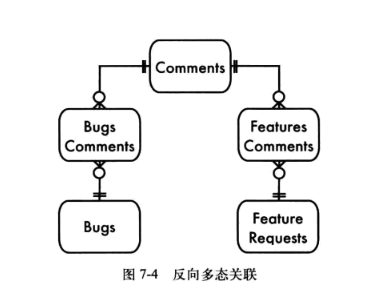

```sql

select *
from BugsComments As b
  Join Comments  as c using (comment_id)
where b.issue_id = 1234;
```

```sql
SELECT*
FROM Comments AS c
  LEFT OUTER JOIN  (BugsComments J0IN Bugs AS b USING  (issue_id))
    USING  (comment_id)
  LEFT OUTER JOIN  (FeaturesComments JOIN FeatureRequests AS f USING  (issue_id))
    USING  (comment_id)
WHERE c.Comment_id =9876;
```

### 9 元数据分裂


